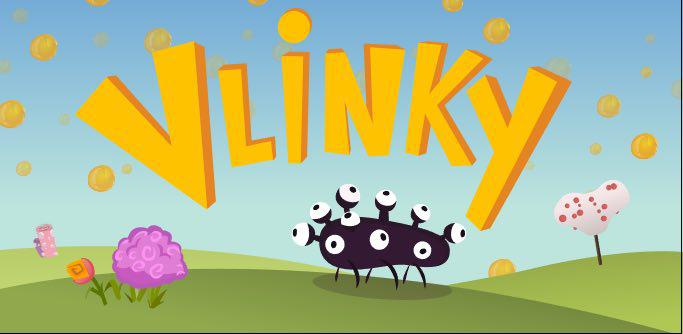
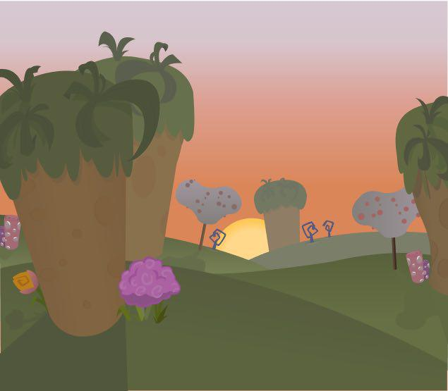
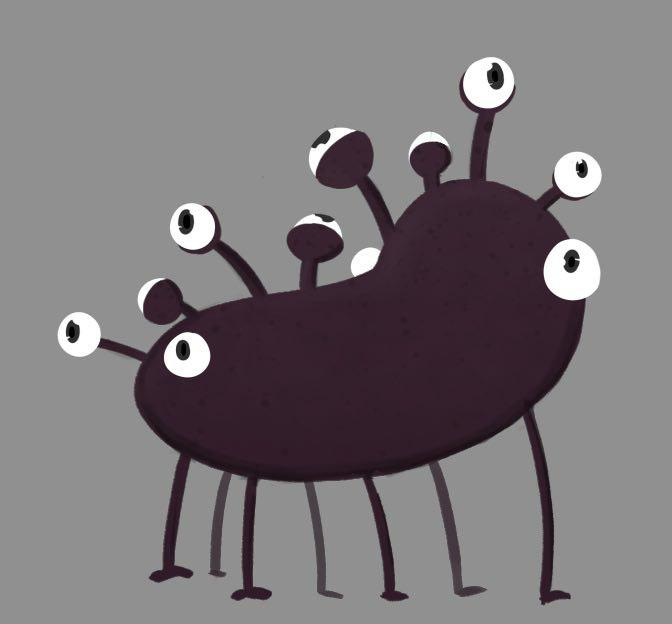
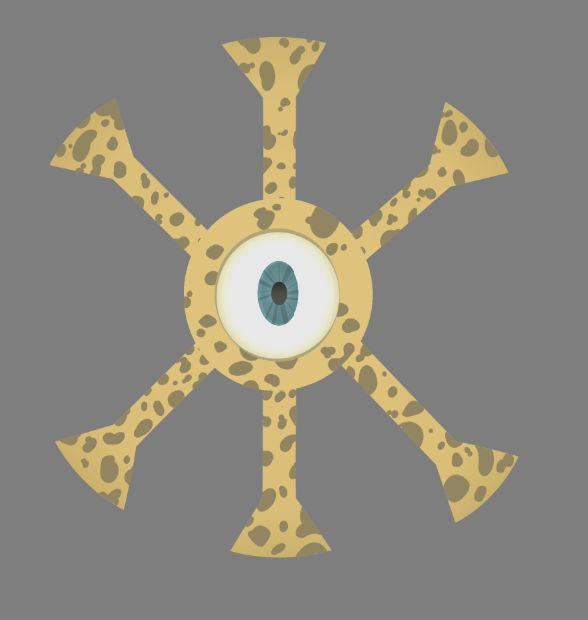
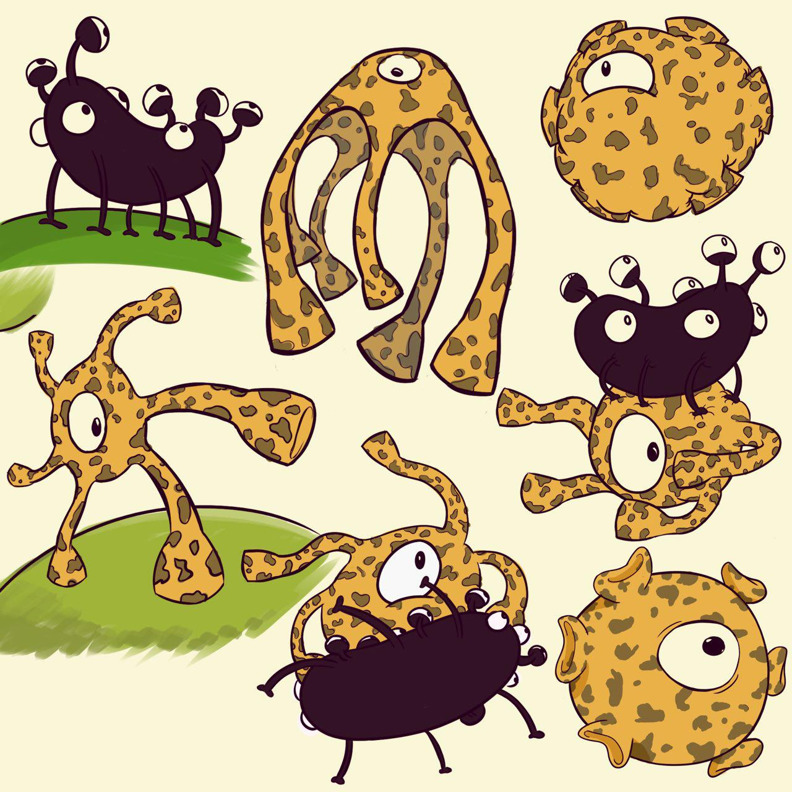
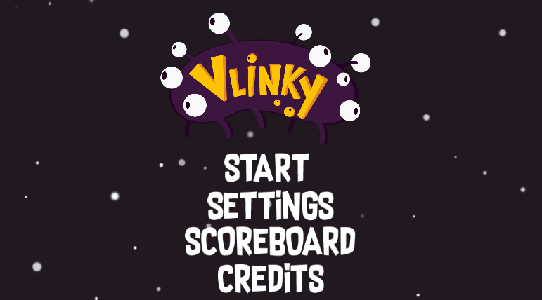
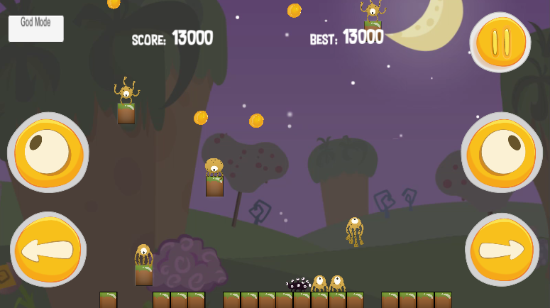
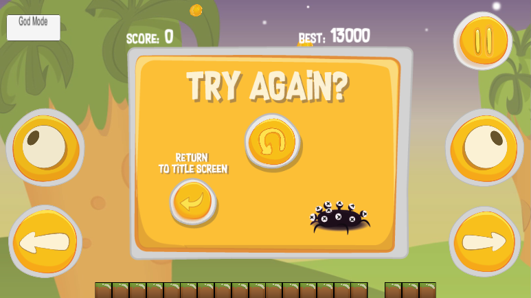

# Vlinky
Unity project for an Android game. Gameplay mechanics cloned from Pyoro 2.

This is still a work in progress.

## Credits
Handcrafted with :heart: in Granada by:
- **[Manu Moya](https://github.com/Moya1407)** (gameplay programmer)
- **[Emilio Kessel](https://www.instagram.com/ekesselm/)** (artist, interface designer and 2D animator)

Driven and supervised by **[GambusinoLabs](gambusinolabs.com)** (artistic direction, music and programming support). Also with :heart:.

## License
This project is open source under the **[GNU General Public License v3.0](LICENSE)**.

## Art

More at [images folder](Images/)

## Screenshots

